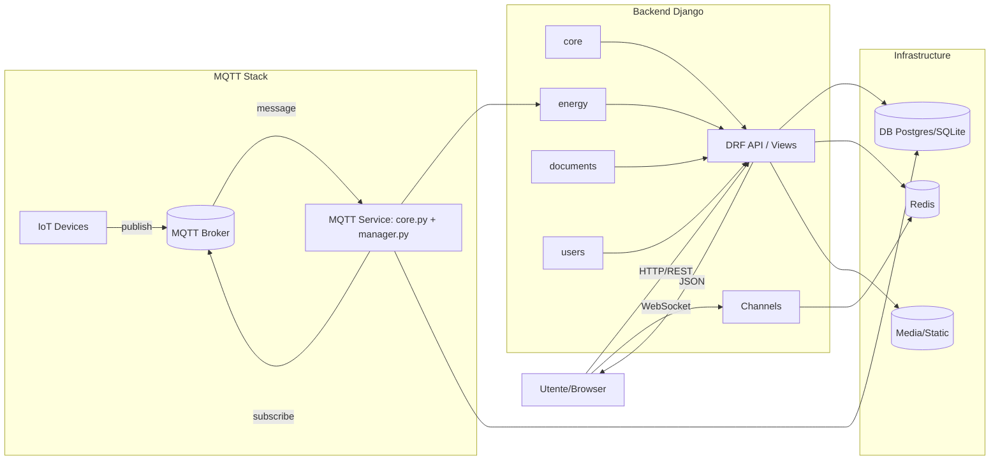
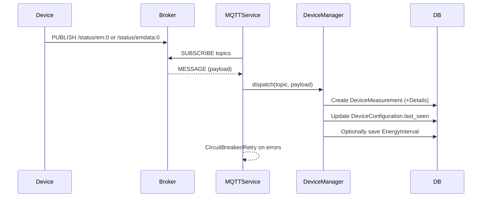
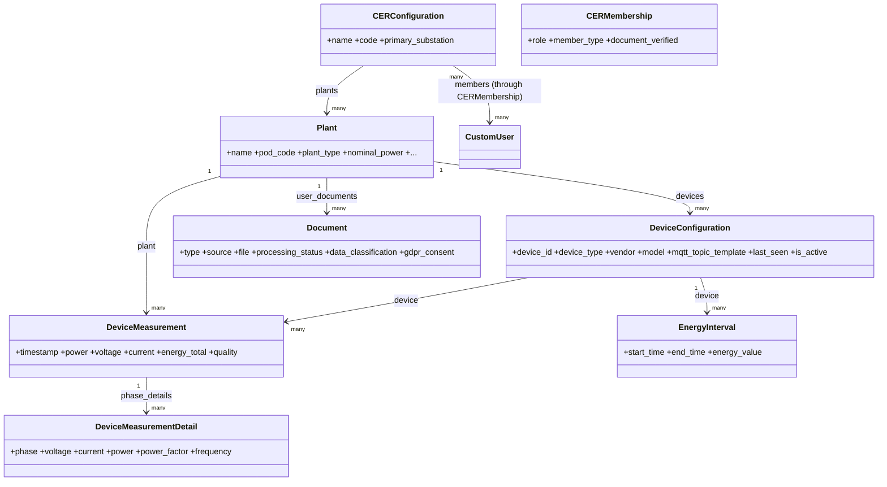

# CerCollettiva — Panoramica Tecnica e Riepilogo Codice

Questo documento riassume l'architettura, la struttura del codice, i moduli principali, le API esposte, i flussi MQTT, le criticità note e le proposte di miglioramento emerse dall'analisi completa del repository.

## Scopo
- Fornire mappa chiara del progetto per sviluppo, audit e manutenzione.
- Evidenziare punti di attenzione tecnici e operativi (sicurezza, coerenza modelli, duplicazioni, bug).
- Suggerire azioni prioritarie per stabilità, sicurezza e pulizia del codice.

## Architettura in Breve
- Framework: Django 5 + DRF, Channels (WebSocket), Redis (cache + channels), Paho MQTT.
- App principali: `core` (CER e impianti), `energy` (dispositivi, misure, MQTT), `documents` (documenti + Gaudì), `users` (CustomUser), `monitoring` (health/metrics).
- Configurazioni per ambienti in `cercollettiva/settings/{base,local,production}.py`.

## App e Responsabilità
- `core`: modelli/flow per CER, impianti, membership, dashboard e API JSON semplici.
- `energy`: modelli dispositivi/misure, API DRF, servizi di aggregazione energia, stack MQTT.
- `documents`: gestione documenti utente/impianto, processamento attestato Gaudì, GDPR/retention.
- `users`: modello utente personalizzato, form, viste profilo/gestione.
- `monitoring`: endpoint di health per DB/MQTT/cache/sistema e metrics base.

## Settings principali
- Base: `cercollettiva/settings/base.py` — DRF, Redis cache, Channels, sicurezza, MQTT_SETTINGS, logging.
- Local: `cercollettiva/settings/local.py` — DEBUG, SQLite, log estesi, cache in‑memoria.
- Production: `cercollettiva/settings/production.py` — Postgres, TLS, Sentry, HSTS, storage statici, hardening.

Nota sicurezza: la chiave di cifratura campi è presente in chiaro in repo (`FIELD_ENCRYPTION_KEY`), vedi Criticità.

## Modelli dati principali (selezione)
- `core/models.py`
  - `CERConfiguration`: dati identificativi CER, relazione M2M utenti tramite `CERMembership`.
  - `CERMembership`: ruolo (ADMIN/MEMBER/TECHNICAL), tipologia (PRODUCER/CONSUMER/PROSUMER), documenti correlati, audit documenti, utility tessera/registro.
  - `MembershipCard`, `MemberRegistry`: tessera e registro soci con progressivo per CER.
  - `Plant`: anagrafica impianto (POD, tipo, indirizzo, Gaudì), geocoding, MQTT, metriche aggregate di base.
  - `PlantMeasurement`, `PlantDocument`, `Alert`.
- `energy/models/device.py`
  - `DeviceType`: metadati tipo (capabilità, template topic/payload).
  - `DeviceConfiguration`: dispositivo legato a `core.Plant`, mapping device_type→vendor/model, stato `last_seen`.
  - `DeviceMeasurement`: misura istantanea (power/voltage/current/energy_total/pf) + `DeviceMeasurementDetail` per fase.
- `energy/models/energy.py`
  - `EnergyInterval` (15min), `EnergyMeasurement`, `EnergyAggregate` (hour/day/month/year) con indici e vincoli.
- `energy/models/mqtt.py`
  - `MQTTBroker` (config broker unico attivo), `MQTTConfiguration` per credenziali per‑device (encrypted password).
- `documents/models.py`
  - `Document`: tipologie (ID_DOC, BILL, GAUDI, …), GDPR/retention, pipeline processing (Gaudì), checksum.

Relazioni chiave: `Plant -> DeviceConfiguration -> DeviceMeasurement -> EnergyMeasurement/EnergyInterval/EnergyAggregate`.

## API
- Core JSON API (`core/views/api/*` — URL in `core/urls.py`):
  - `GET core/api/plants/<pk>/data/`: serie potenza (W) e daily energy, info impianto.
  - `GET core/api/plants/<plant_id>/measurements/`: serie completa potenza/tensione/corrente/energy_total.
  - `GET core/api/cer-power/`: potenze kW per CER (producer/consumer/net) filtrate per accesso utente.
  - `GET core/api/mqtt/status/<plant_id>/`: stato connessione MQTT dispositivo principale.
- DRF API (`energy/views/api.py` — URL in `energy/urls.py`):
  - `PlantViewSet`: CRUD + azioni `statistics` (potenza corrente, produzione daily/monthly) e `device_status`.
  - `DeviceConfigurationViewSet`: CRUD + `latest_measurement`.
  - `DeviceMeasurementViewSet`: list/filters/ordering + `latest`.
  - Router sotto `energy/api/` e `api/energy/` (namespace).

## Stack MQTT
- Implementazione “nuova”: `energy/mqtt/core.py` (MQTTService con CircuitBreaker, retry, topic handler) + `energy/mqtt/manager.py` (DeviceManager: mapping topic→device, deduplica, salvataggi misure, calcolo delta energia da `emdata:0`).
- Implementazione “legacy”: `energy/mqtt/client.py` (Paho client con coda, sottoscrizioni e heartbeat) con proprio `DeviceManager` interno.
- Handler generici in `energy/mqtt/handlers/*` (parsing/validazione/salvataggio misure).
- Topic supportati (Shelly): `<vendor>/<pod_code>/<device_id>/status/em:0` e `/status/emdata:0`.

Flusso tipico: Broker → MQTTService/Client → parsing payload → `DeviceMeasurement` + dettagli fase → aggiornamento `last_seen` → (eventuale) calcolo `EnergyInterval`/aggregazioni.

## Servizi Energia
- `energy/services/energy_calculator_*`:
  - `..._measurements.py`: da total_energy calcola delta per intervallo (15 min) con cache ultimo valore.
  - `..._aggregations.py`: calcola hour/day/month/year aggregando intervalli e memorizza in cache.
  - `..._cache.py`: chiavi cache per diversi intervalli, invalidazioni/intelligenza aggiornamenti.
- `energy/services/utils.py`: aggregazioni per periodo, `get_latest_measurement`, `check_measurement_quality`.

## Frontend e Template
- JS principali: `static/js/power-chart.js` (grafico potenza con bucket 15min), `static/js/plant-detail.js` (statistiche impianto), `static/js/mqtt-status.js`, `static/js/main.js`.
- Template base in `templates/` e app‑specifici in `core/templates`, `energy/templates`, `documents/templates`.

## Monitoring
- Health endpoints in `monitoring/` per DB, MQTT (config attiva), cache e risorse sistema, con status `HEALTHY/DEGRADED/UNHEALTHY` e tempi risposta.

## Test e Migrazioni
- Test presenti in `CerCollettiva/tests/*` sono obsoleti rispetto al modello attuale (campi/naming divergi). Esecuzione attuale fallirebbe.
- Le migrazioni non sono versionate nel repo: generarle per ogni app prima di CI/deploy.

---

## Criticità Rilevate (con contesto) 
1) Segreti in chiaro
- `cercollettiva/settings/base.py`: `FIELD_ENCRYPTION_KEY` hardcoded.
  - Rischio: esposizione chiavi e impossibilità di rotazione. Spostare su variabile d’ambiente/secret manager.

2) Duplicazioni/ambiguità in `core/models.py`
- `test_mqtt_connection`: definito sia come metodo di `Plant` sia come funzione globale con stessa signature (shadowing e side effect) — va mantenuta solo la versione metodo.
- `get_total_system_power`: definito due volte con logiche quasi identiche — mantenerne una sola.
- `Alert`: campi `status`, `severity`, `message`, `created_at` dichiarati due volte — rimuovere duplicati e rigenerare migrazioni.

3) Stack MQTT duplicato/legacy
- Coesistenza di `energy/mqtt/client.py` e `energy/mqtt/core.py`+`manager.py`. Unificare su un’unica implementazione (consigliato il servizio nuovo con CircuitBreaker/handlers).
- Moduli legacy incoerenti: `energy/mqtt/auth.py` e `energy/mqtt/acl.py` referenziano `MQTTCredential` inesistente e `Plant.pod` (oggi `pod_code`). Disattivare o allineare con modello reale prima dell’uso.

4) Bug query/utilities
- `energy/services/utils.py`: usa `models.Q` senza import e filtra `DeviceMeasurement` con `device_id=<string>` (FK int). Corretto: `from django.db.models import Q` e filtri su `device__device_id=<string>`.

5) Dipendenze mancanti
- `documents/services.py` usa `pdfkit` ma non è presente in `requirements.txt`. Aggiungere `pdfkit` (e runtime `wkhtmltopdf`) o migrare a `WeasyPrint`.

6) Logging a livello modulo
- `users/signals.py` crea handler file/console al momento dell’import. Allineare alla configurazione `LOGGING` dei settings per evitare duplicazioni/side‑effect.

## Proposte di Miglioramento (priorità)
A. Sicurezza e configurazione
- Spostare `FIELD_ENCRYPTION_KEY` e qualsiasi credenziale in env; verificare uso `encrypted_model_fields` con key management.

B. Pulizia modelli core
- Rimuovere funzione globale `test_mqtt_connection`; unificare `get_total_system_power`; ripulire `Alert`; generare migrazioni.

C. Unificazione MQTT
- Standardizzare su `MQTTService` + `DeviceManager` (nuovo), rimuovendo o disabilitando il client legacy e i moduli `auth.py`/`acl.py` finché non esiste un modello credenziali coerente.

D. Fix servizi energia
- Correggere import e filtri in `energy/services/utils.py`; aggiungere test unitari mirati a questi utility.

E. Dipendenze documenti
- Aggiungere `pdfkit` ai requirements o sostituire con `WeasyPrint`; documentare prerequisiti OS.

F. Test e migrazioni
- Rigenerare test coerenti con i modelli attuali; aggiungere migrazioni versionate per tutte le app.

## Note Operative
- Endpoint admin: `/ceradmin/` (custom admin site) — vedi `cercollettiva/urls.py`.
- API DRF sotto `/energy/api/` e `/api/energy/` (router con `app_name='energy'`).
- Health endpoints sotto `/monitoring/`.

---
Ultimo aggiornamento: documento generato dalla scansione completa del codice sorgente nel repository locale.

## Diagrammi Mermaid

### Architettura (Flowchart)

### Flusso MQTT (Sequence)

### Modelli principali (Class Diagram)

